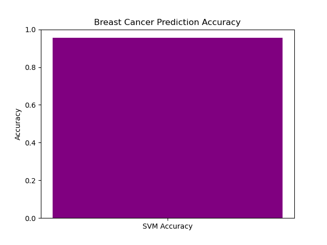

# Breast Cancer Prediction using SVM

## 📌 Description
This project uses the Breast Cancer Wisconsin dataset from `sklearn` and applies **Support Vector Machine (SVM)** to classify whether a tumor is malignant or benign based on medical features.

## 🧠 Technologies Used
- Python
- Scikit-learn
- Pandas
- Matplotlib

## ⚙️ How It Works
- Loads breast cancer dataset
- Preprocesses the data (scaling, splitting)
- Trains an SVM model
- Evaluates model performance (confusion matrix + accuracy)
- Visualizes results using a bar chart

## 📊 Output

## ✅ Accuracy Achieved
Expected accuracy: **~95–98%**
